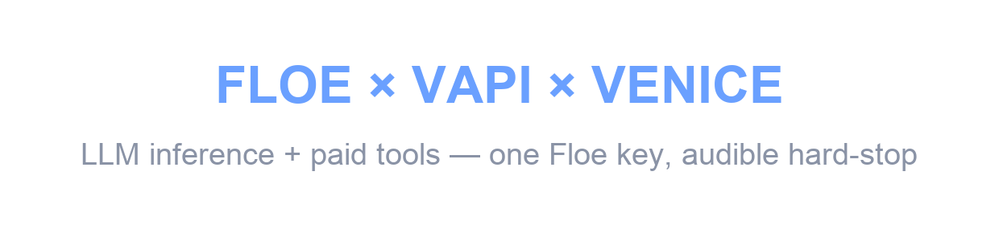
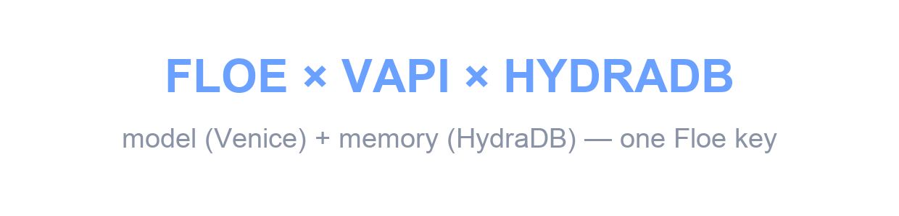

<p align="center">
  <h1 align="center">🍳 Floe Cookbook</h1>
  <p align="center">Reference AI agents built on Floe — the spend layer for agents. One Floe key pays every vendor, with programmable spend controls.</p>
</p>

<p align="center">
  <a href="./LICENSE"></a>
  <a href="./.github/workflows/ci.yml"></a>
  <a href="https://floe-labs.gitbook.io/docs"></a>
  <a href="https://x.com/FloeLabs"></a>
  <a href="https://github.com/Floe-Labs"></a>
</p>

<p align="center">
  <a href="https://floelabs.xyz">Website</a> ·
  <a href="https://dev-dashboard.floelabs.xyz">Dashboard</a> ·
  <a href="https://floe-labs.gitbook.io/docs">Docs</a> ·
  <a href="https://floe-labs.gitbook.io/docs/quickstart">Quickstart</a>
</p>

---

## Start building with Floe

One key for your agent's whole vendor bill — LLM, voice, telephony, search, data — metered per call and budget-capped. Let your coding agent set it up, or wire it yourself:

| Path | One line |
|---|---|
| **Agent** — Claude Code / Cursor does the setup | paste: `Read https://dev-dashboard.floelabs.xyz/agents.md and set up Floe for this project.` |
| **Skill** — install the Floe agent skill | `npx skills add floe-labs/agent-skills` |
| **MCP** — hosted MCP server (65 tools) | `npx -y add-mcp https://mcp.floelabs.xyz/mcp` |
| **NPM** — the CLI + SDK | `npm i -g floe-agent` |

New accounts get a **$3 Welcome Credit (300 API credits)** — no card. [Set up with your AI tools →](https://floe-labs.gitbook.io/docs/getting-started/setup-with-ai-tools) · [Get a key →](https://dev-dashboard.floelabs.xyz)

## What is this?

A cookbook of small, self-contained reference agents that show **Floe** in real
frameworks — Vapi, LangChain, CrewAI, Coinbase AgentKit, MCP, the OpenAI Agents
SDK, and plain SDKs. Each folder is an independent example you can read, copy, and
run on its own. This is a **gallery, not a template** — there's nothing to clone
wholesale; pick the recipe closest to what you're building.

**Floe is the spend/billing layer for AI agents.** It's walletless and priced in
USD. **One Floe key** pays every vendor your agent uses — the model, memory,
tools, and 2,000+ x402 API services — through a single endpoint, governed by
programmable, context-aware spend controls. That's **unified billing** for
agents: rail-agnostic, one key, one ledger, no per-vendor accounts, no crypto.

> **Start free.** Create an agent key at the
> [dashboard](https://dev-dashboard.floelabs.xyz), fund it with a card, and your
> agent makes its first paid API call in minutes.

## What you can build

- **Voice agents** that pay per-lookup for live web search and stop cleanly at a budget — [`vapi-voice-agent`](./vapi-voice-agent), [`vapi-venice-voice-agent`](./vapi-venice-voice-agent) — or that **remember callers across calls** via HydraDB — [`hydra-memory-agent`](./hydra-memory-agent)
- **Budget-capped multi-agent crews** where a runaway loop dies at $1, not $414 — [`crewai-demo`](./crewai-demo)
- **Metered LLM access** — any OpenAI/Anthropic model behind one billed endpoint with a server-side cap — [`metered-llm`](./metered-llm)
- **Add Floe to an agent you already have** — route an existing STT→LLM→TTS agent's spend through Floe's keyless gateway by swapping three values (`baseURL`/`apiKey`/model), no provider key — [`drop-in-existing-agent`](./drop-in-existing-agent)
- **Zero-install access from Claude Desktop / Cursor** via hosted MCP — [`mcp-demo`](./mcp-demo)

## Examples

| Example | Language | Framework / Stack | Difficulty | What it shows | Link |
|---|---|---|---|---|---|
| **metered-llm** | TypeScript · Python | OpenAI SDK (framework-agnostic) | Beginner | Route any OpenAI/Anthropic model through Floe's metered proxy — per-token billing on one key, capped server-side, your provider key never stored. | [→](./metered-llm) |
| **drop-in-existing-agent** | TypeScript · Python | Standard `openai` SDK (framework-agnostic) | Beginner | Add Floe to an agent you already have — swap `baseURL`/`apiKey`/model to route an existing STT→LLM→TTS agent's LLM leg through Floe's keyless gateway, no provider key. | [→](./drop-in-existing-agent) |
| **x402-client** | TypeScript | Coinbase AgentKit | Beginner _(Preview)_ | The minimal payment example: delegate credit to the Floe facilitator, then call any x402 API with automatic, gas-free payment. | [→](./x402-client) |
| **mcp-demo** | Config only | Claude Desktop / Cursor (MCP) | Beginner | Connect Claude Desktop or Cursor to Floe's hosted MCP server in one line — create agents, cap spend, and make paid calls with zero install. | [→](./mcp-demo) |
| **openai-agents** | Config only | OpenAI Agents SDK | Beginner _(Preview)_ | Use Floe from the OpenAI Agents SDK today via MCP fallback, ahead of the native adapter. | [→](./openai-agents) |
| **crewai-demo** | Python | CrewAI · `crewai-floe` | Intermediate | Per-agent budgets with a hard, server-side ceiling: a rigged loop halts at $1, and a procurement crew enforces allowlists and per-role caps. _(Installs `crewai-floe` from a git branch until it lands on PyPI — see its README.)_ | [→](./crewai-demo) |
| **vapi-voice-agent** | TypeScript | Vapi · GPT-4o · ElevenLabs · Exa | Intermediate | An outbound voice concierge that pays for live web search through Floe, tapers as it nears its budget, and audibly hard-stops at the cap. | [→](./vapi-voice-agent) |
| **vapi-venice-voice-agent** | TypeScript | Vapi · Venice · ElevenLabs · Exa | Advanced | Same voice concierge, but the **LLM inference itself** runs on Venice through Floe — model *and* tools metered on one key, with an audible hard-stop. | [→](./vapi-venice-voice-agent) |
| **hydra-memory-agent** | TypeScript | Vapi · Venice · HydraDB | Advanced | A voice concierge with **persistent memory** — it stores caller facts in HydraDB and recalls them, so a later call greets you by name. Brain (Venice) + memory (HydraDB) on **one Floe key**, no vendor keys. | [→](./hydra-memory-agent) |

> **Difficulty** is a rough guide: _Beginner_ = a key and a few minutes;
> _Intermediate_ = a webhook, a framework, or a running server;
> _Advanced_ = a multi-vendor stack (e.g. Venice inference, HydraDB memory).
> **_(Preview)_** marks examples whose script is a printed walkthrough of the
> flow — full docs and env setup, but not yet runnable against the live API.
> Runnable versions are on the way; each README says exactly what runs today.

## Demos

Two of the most-requested flows, end to end. Click a card to watch (~90s each).

### Venice voice agent — model *and* tools on one Floe key

<a href="https://github.com/Floe-Labs/floe-cookbook/releases/download/demo-media-v1/venice-audiogram.mp4"></a>

A phone call where the LLM inference **and** the paid web-search tools both meter
on a single Floe key — tapering as the budget runs down to an audible hard-stop.
See [`vapi-venice-voice-agent`](./vapi-venice-voice-agent).

### Persistent-memory voice concierge — recall across calls

<a href="https://github.com/Floe-Labs/floe-cookbook/releases/download/demo-media-v2/memory-demo-labeled.mp4"></a>

The agent stores caller facts in HydraDB and recalls them on a later call — brain
(Venice) + memory (HydraDB) on **one Floe key**, no vendor keys.
See [`hydra-memory-agent`](./hydra-memory-agent).

## Quickstart

Watch the setup end to end (~90s each) — key, funding, and a first metered call:

<p>
  <a href="https://www.loom.com/share/5e2ff8743ba7435dba1c5429590ec223"></a>
  <a href="https://www.loom.com/share/0e9c894131394fe78524608edd6e59c1"></a>
</p>

Every example is standalone. Pick one, `cd` into it, and follow its README.

```bash
git clone https://github.com/Floe-Labs/floe-cookbook.git
cd floe-cookbook

# Pick an example — e.g. metered LLM calls through Floe's billed proxy
cd metered-llm
cp .env.example .env          # fill in FLOE_API_KEY (and any keys the README lists)

# TypeScript examples
npm install && npm start

# Python examples
pip install -r requirements.txt && python main.py
```

You'll need a Floe API key — [get one at the dashboard](https://dev-dashboard.floelabs.xyz)
and fund it with a card. No wallet or crypto required.

## Use Floe from Claude Code

Prefer to drive Floe from your coding agent? The **[`floe` agent skill](https://github.com/Floe-Labs/agent-skills)**
teaches Claude Code, Cursor, or any Agent Skills client to run the whole vendor stack
on one Floe key — metered, budget-capped, with the per-call receipt — the same pattern
these recipes demonstrate.

```bash
npx skills add floe-labs/agent-skills
```

Canonical home (issues, releases, contributions): **[Floe-Labs/agent-skills](https://github.com/Floe-Labs/agent-skills)**.

## Contributing

New recipes are welcome. See [CONTRIBUTING.md](./CONTRIBUTING.md) and the
per-example README template at [docs/EXAMPLE_TEMPLATE.md](./docs/EXAMPLE_TEMPLATE.md).

## License

[MIT](./LICENSE) © Floe Labs
